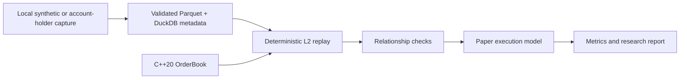

# EventBook

> Local-first, research-only L2 order-book replay for binary event markets.

EventBook tests a deliberately narrow question: **does an apparent relationship inconsistency remain attractive after executable quotes, displayed depth, partial fills, queue assumptions, fees, and latency are modeled?**

It is a portfolio-quality research system, not a live trading bot. It has no live order submission, account funding, credential handling, or profitability claims.

## Why this exists

Binary-contract prices look like probabilities, but a midpoint discrepancy is not a trade. A usable research result has to survive the actual book and an explicit execution model. EventBook reconstructs local L2 state, evaluates manually verified contract relationships, and replays paper orders deterministically.



## Safety boundary

- Research and paper simulation only.
- No exchange API client, live order submission, funding, or account mutation.
- Raw exchange-derived data stays local in ignored paths.
- No credentials belong in this repository, logs, tests, or screenshots.
- Synthetic outputs demonstrate behavior only; they are not evidence of profit or arbitrage.

## What is implemented

| Area | Included |
| --- | --- |
| L2 book | C++20 aggregated book, deterministic event validation, depth and spread queries |
| Execution | Marketable limits, passive orders, partial fills, queue assumptions, fees, seeded latency, position limits, settlement PnL |
| Relationships | Manual YAML mappings for threshold monotonicity, mutually exclusive outcomes, intersection and union bounds |
| Evaluation | Gross/net PnL, fill and cancel rates, drawdown, Sharpe, turnover, capacity, rejection reasons, bootstrap interval, FIFO holding periods |
| Data | Deterministic synthetic fixture; local JSONL → Parquet + DuckDB ingestion |
| Reporting | Markdown report, Parquet trades, CSV outputs, and portable SVG charts |

## Quick start

Prerequisites: Python 3.12+, [uv](https://docs.astral.sh/uv/), CMake 3.20+, and a C++20 compiler.

```bash
git clone <your-fork-url> eventbook
cd eventbook

uv run --with pytest pytest -q
cmake -S . -B build
cmake --build build
ctest --test-dir build --output-on-failure

uv run python -m eventbook.reports.run \
  --config configs/synthetic_baseline.yaml \
  --output results/synthetic_baseline
```

Open [the generated report](results/synthetic_baseline/report.md). The command creates `summary.json`, `trades.parquet`, equity and signal CSVs, latency sensitivity data, and five SVG charts.

## Local data workflow

EventBook accepts a local JSONL capture; it never fetches data itself. Each line needs:

```json
{
  "timestamp_ns": 1700000000000000000,
  "sequence": 1,
  "ticker": "EXAMPLE_EVENT",
  "side": "bid",
  "action": "add",
  "price_cents": 54,
  "quantity": 10,
  "order_id": "optional-local-id"
}
```

Convert a capture to ignored local artifacts:

```bash
uv run python -m eventbook.collector.local_ingest \
  /absolute/path/to/local_capture.jsonl
```

It validates values and per-ticker sequences, then writes Parquet under `data/processed/` and dataset metadata to `data/local_metadata.duckdb`. Neither is tracked by Git.

Relationships must be explicitly reviewed and added to YAML; see [synthetic_relationships.yaml](configs/synthetic_relationships.yaml). EventBook intentionally does not infer market semantics from contract text.

## C++ Python bindings

The optional pybind11 module exposes C++ `OrderBook`, `BookLevel`, and `Side` primitives:

```bash
cmake -S . -B build \
  -DEVENTBOOK_BUILD_PYTHON_BINDINGS=ON \
  -Dpybind11_DIR="$(uv run --with pybind11 python -m pybind11 --cmakedir)"
cmake --build build
ctest --test-dir build --output-on-failure
```

The Python replay remains the event-driven simulator. The binding is a verified integration seam for a future C++ replay-core migration.

## Research interpretation

The synthetic report may show a positive or negative number because it is designed to exercise accounting and rejection paths. It is not a backtest claim. Before interpreting a local dataset, use time-based train/validation/test splits, vary latency and queue settings, keep test data untouched, and report rejected signals alongside fills.

Read the full [research protocol](docs/research_protocol.md), [modeling assumptions](docs/assumptions.md), [data governance policy](docs/data_governance.md), and [architecture notes](docs/architecture.md).

## Development

```bash
# Python test suite
uv run --with pytest pytest -q

# C++ core test suite
cmake -S . -B build && cmake --build build
ctest --test-dir build --output-on-failure
```

Please read [CONTRIBUTING.md](CONTRIBUTING.md) before opening a change. Security concerns belong in [SECURITY.md](SECURITY.md), not public issues.

## Deliberate limits and next steps

The project does not yet make Python replay invoke the C++ core for every event, reserve shared depth across simultaneous multi-leg orders, or connect to an exchange. Those are intentional boundaries, not hidden behavior. Any future collector must remain account-holder local and read-only unless this project’s safety policy is explicitly revised.
