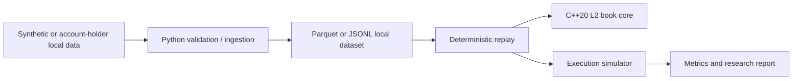

# Architecture

The C++ core owns aggregated L2 state and invariants. Python owns local ingestion, experiment configuration, relationship rules, and reporting. Bindings are intentionally an optional build integration: no live exchange client exists.
